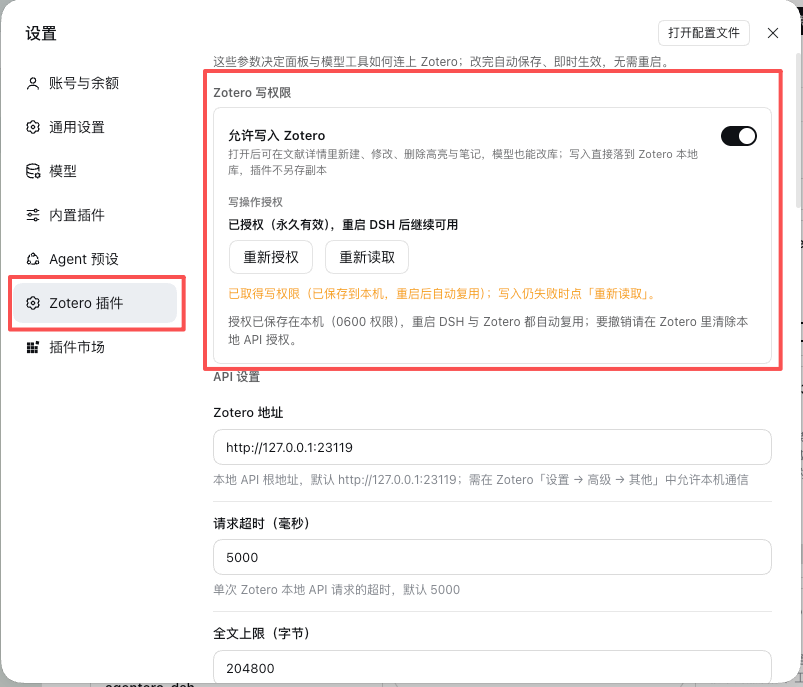
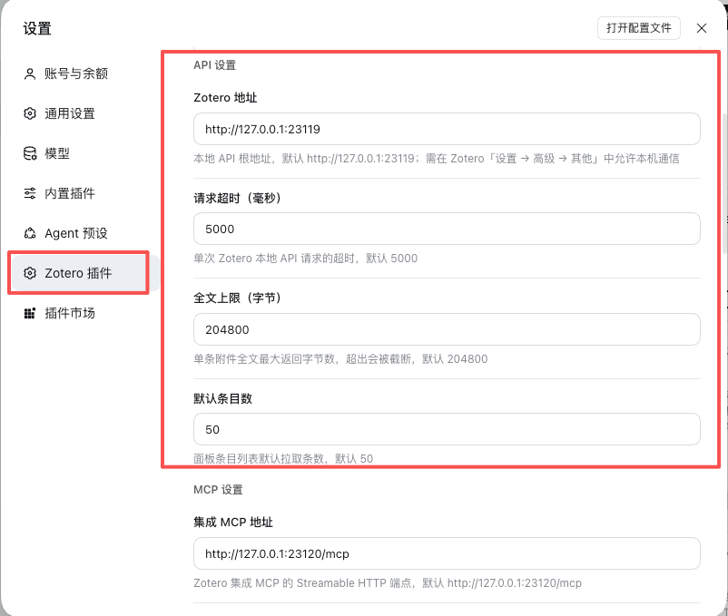
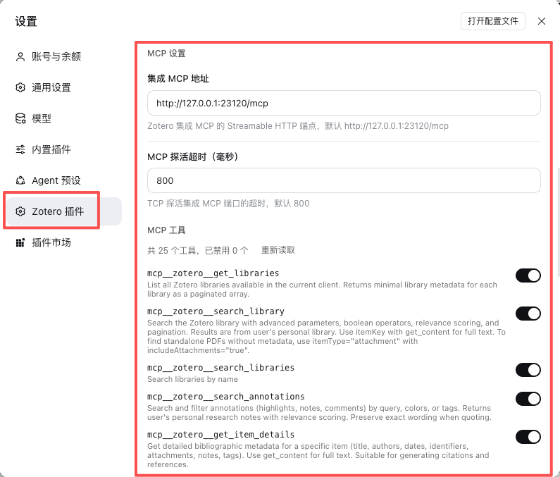

# dsh-plugin-zotero

**把 Zotero 文献库映射进 DSH：用AI管理操作Zotero，读文献时让AI辅助你。**

本插件把 Zotero 的文库结构、元数据、PDF 全文、笔记与标注接入 DSH，将「检索文献 — 精读全文 — 摘录标注 — 与模型讨论 — 形成稿子」收进同一条工作流：右侧栏按分类与标签浏览文库，按标题 / 摘要筛选当前范围，双击条目即在 DSH 内打开独立阅读页，PDF 整页渲染、高亮原位叠加，同一篇文献的原文与译本附件可在页内切换；读到关键段落时可直接划词摘录，或引用该条标注、笔记乃至整篇文献，以引用胶囊写进当前会话草稿，模型随即基于原文接续完成综述、方法对比、数据提取与引文核对。

模型侧同样具备完整的检索与整理能力：检索文库、精读 PDF、汇总高亮与笔记、按主题新建分类并归类，也可以把本地下载的论文导入 Zotero，读完外文文献后把译文作为附件回挂到对应条目。凡 Zotero 本地接口与集成 MCP 能提供的操作，均可由模型代劳。

不用写代码，也不用记命令。第一次使用前，只需在 Zotero 里完成两项一次性设置（装一个桥接小插件、打开通信开关），步骤见[使用前提](#使用前提)。

## 截图

[](docs/images/zotero-pane.png)

<sub>上图为 DSH 会话与右侧「Zotero 文献库」面板：左侧分类树与标签面板，右侧是当前范围的条目列表；双击条目会在右侧栏顶层单开一个标签页，整页展示 PDF（可缩放、叠加高亮标注），元数据、摘要、笔记、标注与附件收进左上角的信息按钮。点击图片可查看原图。</sub>

[](docs/images/zotero-reading-with-ai.png)

<sub>上图为 DSH 内的文献阅读现场：右侧标签页整页渲染 PDF（图为译文附件，原文与译本可在信息面板切换），点正文里的高亮标注即弹出标注卡片，原文、类型与「引用 / Zotero」入口都在手边；左侧会话里该段原文已作为引用写入草稿，模型据此继续作答。点击图片可查看原图。</sub>

它能替你做的事，举几个常见例子：

- **找文献**：按标题、年份、全文关键词检索，也能跨库搜高亮和批注，快速回答「我收过哪些讲 XX 的文章」；右侧栏里还能按分类、标签和标题 / 摘要逐层缩小范围。
- **读文献**：双击条目就在 DSH 内开独立阅读页，PDF 整页渲染、高亮原位叠加，原文与译本附件随时切换；摘要、全文、笔记与标注都能在这里读完，写综述、做对比、提取数据都行，需要精确引用时会保留原文措辞。开启写权限后，正文里划选即选颜色落一条高亮或下划线（跨页自动按页拆条）、随手带一句评论，改色、改评论、改页码、加标签、高亮↔划线互转、删除都在同一处；笔记也能新建、编辑、删除。改动直接进 Zotero 库，不是插件里的副本。
- **整理文库**：新建、重命名、移动、删除分类，批量把条目加入或移出分类。你说一句「把这几篇归到『待读』里」，它就照做。
- **帮你入库**：把本地下载好的论文、PDF 交给 DSH 导入 Zotero；也可以让它读完外文文献后，把译文作为附件挂回条目。
- **带进对话**：右侧面板单条目引用、列表多选批量引用、阅读页划词摘录与点高亮引用、单标签或多标签引用、整分类引用，一键写进当前会话草稿（不自动发送），你再接着说要求。条目、标签和整分类以「引用胶囊」的形式出现，草稿里一眼看清引了哪几篇，单独删掉某一条也不影响其他内容。
- **安全可控**：写能力默认全关 —— 配置卡里「Zotero 写权限」不开启，面板就是纯只读，模型也看不到任何写工具。开启后写操作优先走集成 MCP（在 Zotero 进程内执行，不触发本地 API 授权弹窗），标注与笔记这两类 MCP 覆盖不到的才走本地 API，需要一次性点「始终允许」授权；模型侧每一项工具都能单独开关。

面板布局与 Zotero 本体一致：顶部状态栏显示连接状态并提供刷新；左侧是分类树，树下是可拖高、可折叠的标签面板；右侧列表显示当前范围（分类 / 全库 / 标签筛选后）的条目。分类树与条目列表之间的分隔条可拖动，宽度按本机记住。列表里单击条目选中、`Ctrl` / `Cmd` 点选多选，双击才在右侧栏顶层单开一个标签页看详情。阅读页就开在会话旁边的标签里，边读边摘、边问边改，不必在 Zotero 与 AI 两个窗口之间来回切换。

> 面向使用者的完整说明（入口、交互、toast 与错误对照表）见 [插件使用说明](docs/插件使用说明/dsh-plugin-zotero使用说明.zh.md)。

## 安装与设置

第一次使用要走 5 步，**全程点鼠标，不用敲命令、不用写代码**。这 5 步都是一次性的，做完以后每天只要打开 Zotero 和 DSH 就能用。

| 步骤 | 在哪做 | 做什么 | 必须吗 |
|---|---|---|---|
| [1](#第-1-步在-dsh-里安装本插件) | DSH | 安装本插件 | 必须 |
| [2](#第-2-步给-zotero-装一个桥接小插件) | Zotero | 装桥接小插件 Zotero MCP Plugin | 想让 AI 动手就必须 |
| [3](#第-3-步打开-zotero-的本机通信开关) | Zotero | 打开「允许本机其他程序通信」开关 | 必须 |
| [4](#第-4-步回到-dsh-确认已经连上) | DSH | 到「设置 → Zotero 插件」看一眼 | 必须（只是确认） |
| [5](#第-5-步可选想让-ai-帮你改文献库) | DSH + Zotero | 打开写权限并授权 | 想改库 / 划高亮才需要 |

开始前请确认两件事：**Zotero 桌面版已装好并且正开着**（本插件读的是你本机 Zotero 里的文献，不是云端）；**DSH 桌面版 ≥ 0.2.1-rc.3**。

### 第 1 步：在 DSH 里安装本插件

1. 打开 DSH，进「设置」→ 左侧的「**插件市场**」。
2. 如果页面提示「还没有插件索引」，点「**添加索引源**」，把这个地址填进去再点「添加」：`https://awesome-dsh-plugin.com/index.json`。这是社区维护的插件目录，只需加一次。
3. 回到「发现」，搜索框里输入 `zotero`，找到 **dsh-plugin-zotero**（作者 peijiping），点开它。
4. 点「**安装**」，在弹出的确认框里确认，等安装进度走完。
5. 按提示**重启 DSH**。

怎么算装好了：重启后 DSH 右侧栏多出「**Zotero 文献库**」入口，「设置」左侧列表末尾多出「**Zotero 插件**」一页。看到这两个就对了。

<details>
<summary>习惯用命令行的人可以这样装（可选，效果一样）</summary>

```sh
dsh plugin --profile <profile> add dsh-plugin-zotero
```

包内是预构建产物（`lib/` + `client/client.js`），安装时**不运行构建脚本**，无需 `allowBuilds` 授权。要求 dsh ≥ 0.2.1-rc.3（`package.json` 的 `engines.dsh` 为 `>=0.2.1-rc.3 <0.3.0-0`）。本地源码开发见[方案一：本地路径安装](docs/插件发布/方案一本地路径安装.zh.md)。

</details>

### 第 2 步：给 Zotero 装一个桥接小插件

AI 要替你新建分类、导入论文、改条目信息，靠的是 Zotero 端的一个小插件（叫 **Zotero MCP Plugin**）。它装在 Zotero 里，装完不用配置。

1. 打开 Zotero，菜单「**工具 → 插件**」。
2. 在插件市场里搜 `mcp`。
3. 安装列表**第一行**、标签是 `ai` / `integration` 的那个 **Zotero MCP Plugin**（包名 `zotero-integrated-mcp`）。
4. 装好后不需要额外设置，它默认在 `http://127.0.0.1:23120/mcp` 上待命。

[](docs/images/zotero-mcp-plugin-market.png)

<sub>上图为 Zotero 插件市场，第一行「Zotero MCP Plugin」已安装。</sub>

装完还要**在它的设置里勾选「允许写操作」**，否则 AI 能查能读，但让它新建分类会直接报「写操作已禁用」。

> 这一步不做也能用右侧面板浏览文献，只是 AI 那边的 Zotero 工具用不了。如果你装的是**别的** MCP 插件、或端口不是 23120，见[第 4 步](#第-4-步回到-dsh-确认已经连上)改地址。

### 第 3 步：打开 Zotero 的本机通信开关

Zotero 默认不允许别的程序读它的文献库。这个开关就是放行同一台电脑上的程序（也就是 DSH）——**数据不出本机**，端口只对本机开放。

Zotero → **设置** → **高级** → 勾选「**允许此计算机上的其他应用程序与 Zotero 通信**」。

[](docs/images/zotero-allow-communication.png)

<sub>上图为 Zotero「设置 → 高级」中开启本地 API 的开关。</sub>

没勾选的话，DSH 面板会显示「Zotero 未连接」并提示你回来开这个开关。想自己确认一下，可以在浏览器里打开 `http://127.0.0.1:23119/api/`，看到 `Zotero is running` 就是通了（命令行等价写法：`curl http://127.0.0.1:23119/api/`）。

### 第 4 步：回到 DSH 确认已经连上

打开 DSH 的「**设置**」，点左侧列表里的「**Zotero 插件**」。这一页就是本插件的全部设置，从上到下三块：**Zotero 写权限**、**API 设置**、**MCP 设置**。

- 正常情况**一个字都不用改**，默认值就是对的。每一项的含义见[设置项说明](#设置项说明设置--zotero-插件)。
- 回到会话，打开右侧栏的「Zotero 文献库」：顶部状态栏显示连接状态，左边应该已经列出你在 Zotero 里的分类。看到分类树就说明整条链路通了。
- 如果 Zotero 里装的 MCP 插件不是第 2 步那个、或者端口不是 23120：把「**MCP 设置 → 集成 MCP 地址**」改成实际地址（形如 `http://127.0.0.1:<端口>/mcp`）。改完自动保存、立即生效，不用重启。

### 第 5 步（可选）：想让 AI 帮你改文献库

**默认是只读的**：面板只能看和引用，AI 也看不到任何写工具。想在读 PDF 时直接划高亮、写笔记，或者让 AI 帮你整理分类、导入论文，就打开写权限：

1. 「设置 → Zotero 插件」最上面那块「Zotero 写权限」，打开「**允许写入 Zotero**」开关。
2. 等一秒左右让它自动保存（页面会闪一下「正在自动保存…」），下面的按钮就可以点了。
3. 点「**授权 Zotero 写权限**」。Zotero 会弹出一个确认框，**一定要选「始终允许」**——选「允许」只管一次，第二次写入就又失败了。
4. 状态行变成「**已授权（永久有效），重启 DSH 后继续可用**」就完成了。以后重启 DSH、重启 Zotero 都不用再点。

[](docs/images/zotero-settings-write.png)

<sub>上图为「设置 → Zotero 插件」顶部的写权限区块：开关已打开、状态显示「已授权（永久有效）」，主按钮已降级为「重新授权」——正常使用的情况下你不需要再点它。旁边的「重新读取」只是重新查一下本机保存的授权状态，写入报错时点它。</sub>

授权凭据存在本机 `~/.dsh/storages/dsh-plugin-zotero/local-api-key.json`（权限 `0600`，不会出现在任何表单里）。要收回权限，在 Zotero 里清除本地 API 授权即可，插件下次写入被拒后会自动删掉本地副本、回到「未授权」。想临时全面止损，把「允许写入 Zotero」关掉就彻底回到只读。

> 写入是**直接改你本机的 Zotero 库**，插件不另存副本。删除类操作在面板里要点两次（「删除」→「确认删除」）才真删，而且**不进 Zotero 回收站**，撤销不了。

## 设置项说明（设置 → Zotero 插件）

入口只有一个：DSH 的「**设置**」→ 左侧「**Zotero 插件**」。

**没有保存按钮**：任何一项改完、停手约一秒就自动落盘，页面顶部会显示「正在自动保存…」，失败会显示红字提示（再改任意一项就会重试）。所有改动**立即生效，不用重启 DSH**。字段旁出现「已覆盖」表示这一项被你改过、不是默认值，点「恢复默认」即可还原。

### Zotero 写权限

见[第 5 步](#第-5-步可选想让-ai-帮你改文献库)。一句话：**开关管「有没有写入口」，授权按钮管「Zotero 认不认」**，两件事都做完才写得进去。

### API 设置

这块管右侧面板怎么连你本机的 Zotero。**四项默认值适用于绝大多数人，不用动。**

[](docs/images/zotero-settings-api.png)

<sub>上图为「API 设置」区块，显示的是四项的默认值。</sub>

| 界面上的名字 | 默认值 | 说人话 | 什么时候才需要改 |
|---|---|---|---|
| **Zotero 地址** | `http://127.0.0.1:23119` | 本机 Zotero 的门牌号，面板所有数据都从这里取 | 你在 Zotero 里改过本地 API 端口 |
| **请求超时（毫秒）** | `5000` | 等 Zotero 回话最多等 5 秒，超了就报错 | 库特别大、经常提示超时，可以调到 10000 |
| **全文上限（字节）** | `204800` | 一篇附件的纯文本最多给这么多（约 20 万字符），超出部分截掉 | 想让 AI 一次读到更长的全文，可以调大（更费 token） |
| **默认条目数** | `50` | 面板列表一次先拉 50 条，往下点「加载更多」再续 | 想一屏看到更多条目 |

<sub>对应配置字段名（写配置文件时才用得到）：`zoteroBaseUrl`、`requestTimeoutMs`、`fulltextMaxBytes`、`defaultLimit`。</sub>

### MCP 设置

这块管 AI 那边怎么连 Zotero 的桥接小插件。

| 界面上的名字 | 默认值 | 说人话 | 什么时候才需要改 |
|---|---|---|---|
| **集成 MCP 地址** | `http://127.0.0.1:23120/mcp` | 第 2 步装的那个小插件的接头地址 | 换了别的 MCP 插件，或它的端口不是 23120 |
| **MCP 探活超时（毫秒）** | `800` | 每次判断「AI 工具能不能用」时，最多等 0.8 秒 | 机器很慢、状态栏老是误报「模型工具不可用」 |

<sub>对应配置字段名：`mcpUrl`、`mcpProbeTimeoutMs`。</sub>

### MCP 工具（AI 能力逐项开关）

再往下是「**MCP 工具**」清单：现场列出桥接小插件提供的全部工具（本机实测 25 个），每行右边一个开关，顶部写着「共 N 个工具，已禁用 M 个」。

- **关掉某一项**，AI 就再也用不了那个能力（等于从 AI 的工具表里摘掉），比如你不想让 AI 删分类，就把 `delete_collection` 关掉。
- 「**重新读取**」重新拉一次清单；显示「读取工具列表失败」通常是 Zotero 没开或小插件没装。
- 清单里名字带 `write_` / `create_` / `update_` / `delete_` / `add_` / `remove_` 的是会改库的工具，其余是只读的。

[](docs/images/zotero-settings-mcp.png)

<sub>上图为「MCP 设置」区块与下方的「MCP 工具」清单：共 25 个工具、已禁用 0 个，每行右侧的开关单独控制 AI 能不能使用该工具。</sub>

## 常见问题

| 你看到的 | 大概率原因 | 怎么办 |
|---|---|---|
| 面板显示「Zotero 未连接」 | Zotero 没开，或第 3 步的通信开关没勾 | 打开 Zotero，勾上「允许此计算机上的其他应用程序与 Zotero 通信」，回面板点刷新 |
| 状态栏「模型工具不可用」，或工具清单读取失败 | 第 2 步的小插件没装 / 端口不是 23120 | 装 Zotero MCP Plugin；端口不同就改「集成 MCP 地址」，再点「重新读取」 |
| 「设置」里没有「Zotero 插件」这一页 | 插件没装成功或没重启 | 回「插件市场」确认已安装，然后重启 DSH |
| 划高亮 / 写笔记失败，提示未授权 | 第 5 步只开了开关、没点授权按钮 | 点「授权 Zotero 写权限」，弹窗里选「**始终允许**」 |
| 每写一次就弹一次授权框 | 上次选的是「允许」，拿到的是一次性凭据 | 重新点授权，这次选「始终允许」 |
| 授权按钮灰着点不动 | 上面的开关还没打开，或改动还没自动保存 | 先打开「允许写入 Zotero」，等「正在自动保存…」消失 |
| 让 AI 新建分类，报「写操作已禁用」 | Zotero 里那个 MCP 小插件没开写操作 | 到 Zotero 的 MCP 插件设置里勾选「允许写操作」，重试即可，不用重启 DSH |
| 提示「Zotero 里这条已经变了」 | 你（或 AI）在 Zotero 里同时改了同一条 | 刷新后重试；插件宁可报错也不覆盖你的新改动 |
| 草稿里的引用胶囊发送失败，说找不到来源 | 插件被禁用或卸载了，胶囊没人展开 | 重新启用插件，或把胶囊删掉再发 |
| 改了设置好像没生效 | 自动保存失败（顶部有红字） | 按红字提示再改一次任意字段触发重试；仍失败就看是不是被更高优先级配置覆盖 |


## 特性

- **右侧栏面板「Zotero 文献库」**：与 Zotero 本体同构——顶部状态栏（Zotero / 模型工具探活 + 刷新），左侧分类树与标签面板，右侧是当前范围的条目列表；条目独立成列。分类树与条目列表之间的分隔条可拖动，宽度按本机记住。
- **分类筛选**：分类树顶部可按名称筛选目录（同 Zotero 左栏：只筛目录名，命中项与祖先保留、自动展开，不影响右侧条目搜索）。
- **条目列表**：每行显示文献类型图标与作者 / 年份；读过的文献类型图标转为粉色、标题略淡，悬停补上类型名与最后阅读时间。单击选中、`Ctrl` / `Cmd` 点选多选，双击在右侧栏顶层开独立详情页，右键单行可直接插引用；头部搜索框针对当前范围（分类 / 全库 / 标签筛选后）按标题与摘要过滤，列表可分页「加载更多」，选中多条时右上角一次「引用 N」。
- **标签面板**：树下方独立面板，可拖高 / 折叠；标签按 Zotero 的换行胶囊排布并跟随当前目录：选中分类时只列该分类自身条目里出现过的标签（不含子目录，自动标签弱化显示），选中文库根时列出全库标签；可按名称筛选、多选，并切换「全部（AND）/ 任一（OR）」。筛选作用于当前选择的范围，列表头部会显示已选标签胶囊与「清除筛选」；切换目录会自动清除已选标签，避免旧筛选作用到新范围。已选标签可从摘要行合并成一枚「标签组」胶囊引用。
- **条目详情独立成页**：双击条目在右侧栏顶层新开一个标签页，同一条目再次双击只回到已有页；详情页可同时开多个，切换标签页时各自的展开状态与滚动位置都保留（正文常驻挂载）。
- **文档优先版面**：详情页整页显示文献本体——PDF 走 PDF.js 渲染（顶部工具栏缩放、页码、当前页在 Zotero 中打开），没有 PDF 时回退到 API 全文文本。左侧固定的 30px 工具栏不遮挡正文。选中正文即浮出「摘录」按钮，点正文里的高亮则弹出标注卡片（类型、原文、评论，以及「引用」与「在 Zotero 中打开」）。
- **左上角信息面板**：点左上角 `i` 按钮弹出浮层，把文献信息 / 摘要 / 标注 / 笔记 / 附件 / 参考文献分块竖排，每块可单独折叠；点浮层外或按 `Esc` 关闭，点标注定位时自动关闭把焦点还给文档。
- **文档目录**：`i` 左边的列表按钮展开 PDF 自带书签的大纲树，按层级缩进，点一条即跳到对应页（跳完自动收起）；没有书签的 PDF 显示「这篇 PDF 没有目录」。Zotero 本地 API 与集成 MCP 都没有目录数据，这份大纲由插件从 PDF 文件里自己解析（上限 8 层 / 800 条）。
- **笔记可读**：独立笔记（文库里的全局笔记）打开后正文直接占据文档区，跟普通条目一样阅读；子笔记在信息面板的「笔记」块里折叠呈现，正文保留 Zotero 的引用块、标注高亮、表格与外链图片。Host 侧已清洗脚本与事件属性，避免注入。「引用」把该条笔记转成纯文本写进会话草稿。
- **标注可读**：PDF 上的高亮与划线原位叠加在页面上，点页内标注弹出卡片，可当场「引用」或跳回 Zotero 对应页；「标注」块按类型 / 颜色筛选，点条目可跨附件定位、滚动并闪烁，「引用」把该条标注写进会话草稿。
- **多种插入方式**：单条目、列表多选批量、单标签、多标签（合并成一枚「标签组」胶囊，AND/OR 在插入那一刻定格）与整目录引用都以「引用胶囊」写进草稿——胶囊只显示标题，发送那一刻才展开成完整引用文本，模型拿到的内容与以前一致；全文划词摘录、单条标注、单条笔记仍按纯文本插入。所有方式都只写进会话草稿（不自动发送、不抢焦点），文本携带 `itemKey` / `collectionKey` / 标签名供模型接续操作。标签类引用始终按全库范围展开，不受你当时选中哪个分类影响。
- **胶囊依赖本插件展开**：草稿里留着引用胶囊时禁用或卸载本插件，发送会失败并提示找不到引用来源，把胶囊删掉即可继续正常发送。
- **分类只读**：不提供任何新建 / 改名 / 删除分类的按钮——整理分类是模型的活，人在面板里只管浏览与引用。
- **标注与笔记可写（默认关）**：配置卡打开「Zotero 写权限」并授权后，阅读页划选即写高亮 / 下划线（Zotero 色板七色 + 评论一次点明），点页内高亮弹出的标注卡片可当场「添加评论 / 改评论」，「标注」块还支持改色、改页码、加标签、高亮↔划线、删除，「笔记」块支持新建 / 编辑 / 删除。所有写入都直接进 Zotero 本地库，插件不存副本；含 Zotero 引文或标注锚点的笔记只给删除、不给编辑，改正文会让锚点失联。删除是**硬删**，不进 Zotero 回收站，面板里要点两次才会真删。开关关着时上述入口一个都不出现。
- **模型侧工具可逐个开关**：插件自持连接集成 MCP，把工具以 `mcp__zotero__*` 注册进 dsh，可在插件页按工具启用 / 禁用。

---

以下面向开发者与想折腾配置的人，普通使用可以不看。

## 架构

从使用者视角看，插件分两半，职责不重叠、互不依赖：

| 半边 | 能力 | 通道 |
|---|---|---|
| **人侧面板** | 在 DSH 右侧栏浏览 Zotero 文库（分类树 / 标签面板 / 条目列表 / 搜索 / 条目详情 / 笔记 / 标注 / PDF 阅读），把条目（含多选批量）、摘录、标注、笔记、标签或整目录引用写进会话草稿；开启写权限后还能就地新建 / 修改 / 删除高亮、划线与笔记 | 插件在宿主 web server 自注册的 `/dsh-zotero/api/*` 路由（写 action 另需自定义写头） |
| **模型侧** | 检索、精读、按需操作文库；条目 / 分类 / 标签 / 标识符的写走集成 MCP，标注与笔记的写走插件自带的 `zotero_*` 工具 | 插件**自持**连接本机 Zotero 集成 MCP，工具以 `mcp__zotero__*` 注册给模型 |

MCP 没起，面板照常可用；Zotero 没开，模型工具自然也不可用。

代码分布：

| 半边 | 代码位置 | 通道 |
|---|---|---|
| Host | `src/index.ts`、`src/host/`、`src/zotero/` | 把 Zotero 本地 API 包装成 HTTP 端点（读 + 受开关约束的写），挂在 DSH 宿主 web server 上 |
| Client | `src/client/` | 在右侧栏注册 tab、面板正文与插件页配置卡，数据与选择状态放在模块级单例 |

两条数据流：

```
人侧    浏览器面板 ──同源 fetch──▶ /dsh-zotero/api/*（Host 路由）──HTTP──▶ Zotero 本地 API（127.0.0.1:23119）
模型侧  启动 / 配置卡打开 ──sync──▶ 集成 MCP（127.0.0.1:23120）──注册──▶ dsh 工具表（mcp__zotero__*）
```

- Host 路由为 `GET /dsh-zotero/api/<action>`，action 有 `health` / `tree` / `items` / `tags` / `item` / `collection-bib` / `mcp-tools`。`items` 支持 `tag`（重复出现为 AND，`A || B` 为 OR）与 `q` 组合过滤。
- Host 侧带信任栅栏：仅接受 GET，拒绝 `sec-fetch-site: cross-site`，且 `Host` 必须是回环地址（防 DNS rebinding）。
- 响应统一信封 `{ok:true,data}` / `{ok:false,error:{code,message}}`，错误码见 [src/zotero/types.ts](src/zotero/types.ts)。
- 条目详情里的笔记由 Host 侧从 `itemType: "note"` 子条目提取并清洗 HTML（剥离脚本、事件属性与冗余 `data-*`，图片限宽），Client 只负责折叠展示。
- 面板正文会被每个会话各挂一份，因此分类树 / 条目列表 / 标签选中 / 搜索词等状态放在 [src/client/paneStore.ts](src/client/paneStore.ts) 的模块级单例里，各会话看到的是同一块面板；右侧栏的展开状态与 tab 则**按会话**持久。条目详情的取数状态在各自 tab 组件内，互不干扰。
- 无会话时面板仍可通过右侧栏的 guide 入口（「Zotero 文献库」）打开。

## 目录结构

```
src/                      # 插件源码（主包，ESM / NodeNext / strict）
├── index.ts              # Host 半入口：Config schema、HTTP 路由、MCP 桥接与写工具注册
├── host/
│   ├── router.ts         # HTTP 路由 /dsh-zotero/api/<action>，含回环 + 写头栅栏
│   ├── mcp-bridge.ts     # 自持集成 MCP 连接 + 按开关过滤注册模型工具
│   ├── write-tools.ts    # 模型侧标注 / 笔记写工具（writeEnabled 关时不注册）
│   └── static.ts         # PDF.js  worker 等静态资源
├── zotero/
│   ├── client.ts         # Zotero 本地 API 读取 + 笔记提取清洗 + 集成 MCP JSON-RPC
│   ├── write.ts          # 本地 API 写通道：授权复用、版本前置条件
│   ├── key-store.ts      # 写权限凭证落盘（0600）+ 从 Zotero 密钥库导入「始终允许」
│   ├── annotation-writes.ts / notes.ts   # 标注与笔记的增改删语义校验
│   ├── palette.ts        # 从真实库里枚举出的 Zotero 标注色板
│   ├── config.ts         # 端点 / 超时 / 截断阈值 + 运行时设置读取器
│   └── types.ts          # Host ↔ Client 数据契约
└── client/               # Client 半（浏览器）
    ├── index.ts          # 注册右侧栏 tab（面板 + 条目详情）、面板正文与插件页配置卡
    ├── ZoteroCard.tsx    # 插件页配置卡（API 设置 / MCP 设置 / 工具开关）
    ├── ZoteroPane.tsx    # 面板容器：状态栏 + 分类树 / 标签面板 + 条目列表
    ├── CollectionTree.tsx / TagPanel.tsx / ItemList.tsx
    ├── SearchField.tsx   # 目录筛选 / 条目搜索 / 标签筛选共用的紧凑搜索框
    ├── itemType.tsx / readState.tsx       # 文献类型图标与已读标记
    ├── ZoteroItemPane.tsx  # 条目详情 tab 的正文与标题
    ├── ItemDetail.tsx    # 文档优先详情：选附件 / 跨附件定位 / 打开 Zotero
    ├── InfoPanel.tsx     # 左上角悬浮信息面板（可分块折叠）
    ├── OutlinePanel.tsx  # 左上角目录浮层（PDF 书签，点条目跳页）
    ├── viewer/           # 渲染器注册表 + PDF.js 渲染 / 文本回退 / 标注叠加与几何换算
    ├── AnnotationList.tsx / NoteList.tsx    # 标注与笔记列表
    ├── Toast.tsx         # 插入结果等轻提示
    ├── reference.ts / cite.ts  # 引用胶囊的 ref 编码与提交时的文本展开
    ├── useInsertion.ts / inline.ts        # 往会话草稿插入胶囊或纯文本
    ├── styles.ts         # 强调色等共用样式常量
    ├── paneStore.ts      # 跨会话共享的面板状态
    ├── compose.ts        # 插入文本模板
    ├── api.ts            # 调 Host 端点
    └── locales.ts        # zh / en 文案

client/client.js          # tsdown 产物（勿手改）
lib/                      # tsc 产物（勿手改）
cordis.patch.yml          # bundle patch 层：把本插件插入 profile 层栈
docs/                     # 使用说明、Zotero API / MCP 参考、发布与 node 学习笔记
tstest/                   # 独立测试沙盒（commonjs + tsx，与主包隔离）
plugin_helloword/         # 官方插件示例（学习用，勿放正式代码）
.trae/documents/          # 设计与实施方案（本地，未纳入版本控制）
```

主包与子项目分别有各自的 `package.json`；测试沙盒 `tstest/` 环境独立，其依赖不得引入主包。

## 环境要求

- Node + **pnpm**（主包与 `tstest/` 统一用 pnpm，勿与 npm / yarn 混用）。
- **TypeScript ^5.9**：`tsdown@0.22.0` 的 peer 依赖不支持 TypeScript 7.x。
- Zotero 桌面版已运行，且已开启本地 API（见[使用前提](#使用前提)）。
- **模型侧必需**：Zotero 已安装集成 MCP 插件（插件市场中的 **Zotero MCP Plugin** / `zotero-integrated-mcp`），监听 23120——若用其他 MCP 插件或端口不同，需在插件配置卡改 `mcpUrl`；并在 MCP 插件设置中**开启「允许写操作」**。只装插件不开写操作时，模型侧读类工具照常，但让模型新建 / 修改分类会直接报错（插件返回「写操作已禁用」）。详见[模型侧 MCP 与权限边界](#模型侧-mcp-与权限边界)。
- `dsh` CLI 可用。

## 构建

```sh
pnpm install
pnpm build            # tsc：src/ -> lib/（Host 半边）
pnpm build:client     # tsdown：src/client/ -> client/client.js（Client 半边）
pnpm typecheck:client # tsc --noEmit 校验客户端源码
```

## 本地测试启动

本地路径 link 的完整操作见 [方案一：本地路径安装](docs/插件发布/方案一本地路径安装.zh.md)，核心三步：

```sh
dsh plugin --profile demo add ./
dsh --profile demo --dump-config   # 应能看到 dsh-plugin-zotero 一行
dsh --profile demo                 # 启动
```

- **访问地址**：启动后终端会打印 URL（web server 配置 `printUrl: true`），浏览器打开 **http://127.0.0.1:3080**。该地址来自 profile 组合配置里的 web server（`host` 默认 `127.0.0.1`、`port` 默认 `3080`），不是固定端口之外另开的服务。
- **命令来源**：`dsh` 是桌面 App 自带的 CLI（如 `/usr/local/bin/dsh`）；仓库里也装了同一 CLI 的 devDependency，等价写法是 `pnpm dsh --profile demo`，两者读同一个 `~/.dsh/profiles/demo`。
- **启动前**：Host 半边与 Client 半边加载的都是构建产物（`lib/`、`client/client.js`），改完 `src/` 要先按上一节构建，再重启 dsh（见「日常迭代」）。

## 日常迭代

| 改了什么 | 要做什么 |
|---|---|
| `src/`（Host 半边） | `pnpm build` → 重启 dsh |
| `src/client/`（Client 半边） | `pnpm build:client` → 重启 dsh → 浏览器重新打开页面 |
| `cordis.patch.yml` | 重启 dsh |

客户端 bundle **没有热更新**：改完必须重启 dsh 并重新加载页面。

## 配置

### 开启 Zotero 本地 API

见[使用前提 → 开启 Zotero 本地 API](#2-开启-zotero-本地-api)。未勾选时读端点返回 403，面板显示「Zotero 未连接」并提示启用步骤。

### 模型侧 MCP 与权限边界

模型侧工具由**插件自己**桥接：[src/host/mcp-bridge.ts](src/host/mcp-bridge.ts) 直连本机 Zotero 集成 MCP（本机实测暴露 25 个工具），按配置里的 `disabledMcpTools` 过滤后以 `mcp__zotero__*` 注册给模型。[cordis.patch.yml](cordis.patch.yml) **不再**插入 `@deepseek-ai/dsh-mcp-client` —— 它不支持按工具开关，且同 `serverName` 会与自注册工具重名冲突。

⚠️ 前提是 [Zotero 里已装好集成 MCP 插件](#1-安装-zotero-mcp-插件)（或改用其他 MCP 插件并在配置卡填对 `mcpUrl`），并且开启了「允许写操作」。插件未安装或服务未起时，模型侧工具全部不可用；插件装了但没开写操作时，读类工具正常，`create_collection` 等写工具会被插件拒绝（返回「写操作已禁用」），表现为让模型帮忙新建分类直接报错——此时到 MCP 插件设置里打开写操作并重试即可，无需重启 dsh。

⚠️ 模型的写能力有两处来源，都要单独关才收得住：集成 MCP 的 25 个工具里有 10 个写工具（`write_item` / `write_note` / `write_tag` / `write_metadata` / `add_by_identifier` / `create_collection` / `update_collection` / `delete_collection` / `add_items_to_collection` / `remove_items_from_collection`），可在配置卡的「MCP 工具」里逐个关掉；标注与笔记的写是插件自有的 `zotero_update_annotation` / `zotero_delete_annotation` / `zotero_create_note` / `zotero_update_note` / `zotero_delete_note` 五个工具，它们只在「Zotero 写权限」开关打开时才注册，关掉即从模型的工具表里消失。面板侧的分类操作始终只读。

**写操作为什么优先走 MCP**：这些工具在 Zotero 进程内直接改库，不经过本地 API，因此**不会触发 Zotero 的「本地 API 授权」弹窗**。反过来，若让模型用 shell/curl 直接打 `127.0.0.1:23119` 的写接口，就必须先用 `POST /api/local/authorize` 换 key —— 该端点每次调用都会弹一次授权框，用户点「允许」拿到的 key 还是一次性的（首个写请求即被 Zotero 删除），这就是「每写一次就要点一次允许」的根源。为此插件在 [mcp-bridge.ts](src/host/mcp-bridge.ts) 里给所有写工具的描述统一注入了「首选写通道」引导语，并点明标注 / 笔记这两类 MCP 做不到、只能走插件自带的 `zotero_*` 工具；「导入本地文件并挂到某条目下」用 `write_item` 的 `action: "import"` + `filePath` + `parentItemKey`，一条工具调用即可。

### 写权限与授权

写能力默认全关，开启路径是「插件」页配置卡 → 「Zotero 写权限」：

1. 打开「允许在 DSH 里修改 Zotero 文库」并保存 —— 面板的写入口与模型侧的 `zotero_*` 工具同时出现。
2. 点「授权 Zotero 写权限」，Zotero 会弹一次「本地 API 授权」框，**请选「始终允许」**。选「允许」拿到的 key 是一次性的，第二条写就断。
3. 「始终允许」的长期 key 会存到本机 `~/.dsh/storages/dsh-plugin-zotero/local-api-key.json`（`0600`，只在 Host 进程内读写，不进配置存储、不在表单里回显），之后**重启 dsh / 重启 Zotero 都直接复用，不用再点授权**。升级到带本功能的新版本时，会自动从 Zotero 自己的密钥库（profile 下的 `localAPIKeys.json`）导入此前点过的「始终允许」，同样不需要再点一次。撤销授权在 Zotero 侧做即可：下一次写入收到 401，插件随即删掉本地副本并回到「未授权」。

写请求一律带并发前置条件（条目版本），撞上并发改动返回「Zotero 里这条已经变了」而不是覆盖；删除类操作在面板里必须点两次（「删除」→「确认删除」）才会真删，且是硬删、不进回收站。含 Zotero 引文 / 标注锚点的笔记不能编辑，只能删除。出问题时的止血手段仍是那个开关：关掉即彻底回到严格只读。

## 相关文档

- [插件使用说明](docs/插件使用说明/dsh-plugin-zotero使用说明.zh.md) — 入口、交互、toast 与错误对照表
- [Zotero 本地 API 参考](docs/Zotero文档/Zotero本地API参考.md)
- [Zotero 集成 MCP 服务参考](docs/Zotero文档/Zotero集成MCP服务参考.md)
- [方案一：本地路径安装](docs/插件发布/方案一本地路径安装.zh.md)
- [DSH 插件开发文档](docs/DSH插件开发文档/README.zh.md)
- [开发与设计方案](.trae/documents/Zotero-DSH插件开发与设计方案.md)（本地）

## License

[MIT](LICENSE)
